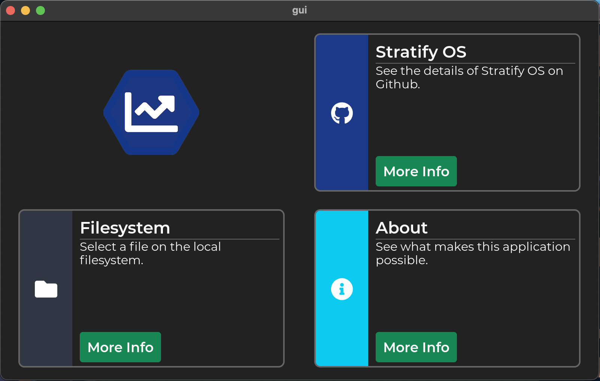
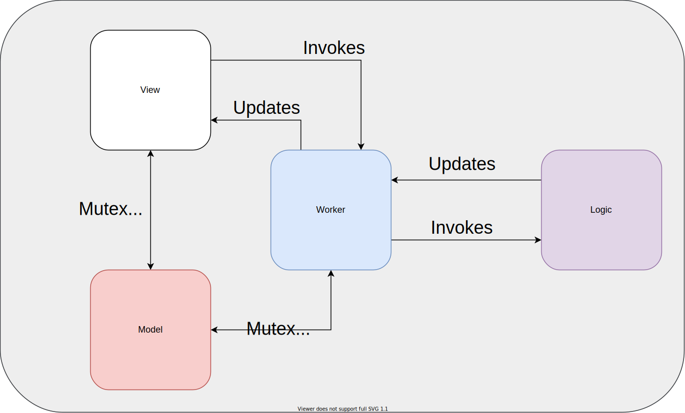

# gui



The **gui** project is a graphical user interface template project. It has the following features:

- Lightweight: distributable application binaries are as small as 5MB
- C and C++: the application code is C++ with various supporting libraries written in C and C++
- No changes to any system files (all build files and dependencies are contained)
- Cross-platform with support for macOS, windows, ubuntu, and [StratifyOS](https://github.com/StratifyLabs/StratifyOS).
- Permissive licenses for all libraries (MIT, BSD, zlib, apache)

## API Features

The **gui** project contains built-in support for:

- [InetAPI](https://github.com/StratifyLabs/InetAPI): `HTTP`, `HTTPS`, `TLS` based on `mbedtls`, and BSD sockets
- [JsonAPI](https://github.com/StratifyLabs/JsonAPI): based on [jansson library](https://github.com/akheron/jansson)
- [CryptoAPI](https://github.com/StratifyLabs/CryptoAPI): AES, ECDSA, ECDH, and SHA256
- [GraphicsAPI](https://github.com/StratifyLabs/LvglAPI): based on [lvgl](https://lvgl.io)
- [WindowAPI](https://github.com/StratifyLabs/WindowAPI): based on [libsdl](https://www.libsdl.org/)
- [Filesystems, Threads, Data Management, Timers, Testing, Printing](https://github.com/StratifyLabs/API): Stratify Labs API
  framework

## Prerequisites

To build `gui` on your computer you need to install:

- `git`
- `cmake`: 3.19 or higher
- A compiler (MinGW on Windows, clang on macOS or GCC on Linux)

All library dependencies are automatically cloned and built with your application.

## Building

You can build the project with the following commands:

> On Windows, you might need to do `cmake -DGENERATOR=Ninja -P bootstrap.cmake` depending on what the default generator is on your system.

```bash
git clone https://github.com/StratifyLabs/gui.git
cd gui
cmake -P bootstrap.cmake
cd cmake_link
cmake .. -GNinja
ninja sdl
rm -Rf *
cmake .. -GNinja
ninja
```

## Anatomy of a GUI Application



The `gui` application executes an `lvgl` runtime loop in the main thread. All operations in the main thread should return quickly to avoid a sluggish user interface. The `View` classes create objects on the gui and use the `lvgl` event handler system to process user input. The `View` classes are purely static functions. They do not retain any data. They turn the memory management of the GUI over to the lvgl memory system. The `LvglAPI` allows you to attach user data to a specific object. Data shared among objects can be placed in the `Model`.

The `Model` is a [C++ singleton class](https://blog.stratifylabs.dev/device/2021-11-29-Using-Singletons-in-embedded-cpp/) that can be accessed from anywhere in the program. Model access is assumed to be in a multi-threaded environment. The `Model::Scope` class locks the `Model` and allows for access to the model within the scope.

```cpp
int my_function(){
 Model::Scope model_scope;
 model().is_dark_theme = false;
}
```

If the user input requires processing that cannot be completed quickly, a `Worker` is used to create a separate thread for processing the request. The `Worker` code should act as a go-between for the `Logic` and the `Model`/`View`. The `Logic` can and should be completely decoupled from the graphical portion. The GUI cannot be updated directly from a background thread. The `design::Worker` class provides a mechanism to push tasks into the `lvgl` runtime and to maintain thread safety while doing so.


